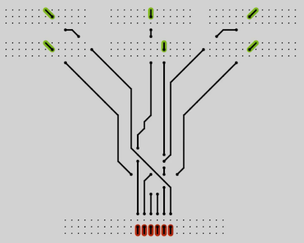

# Circuits

A circuit board generator made using [Processing](https://processing.org/)

## Hotkeys

- Mouse - Click and drag to place new sockets
- C - clear board
- F - Hold to fill grid points
- E - Hold to erase grid points
- R - Rotate socket under cursor
- Backspace - Clear lines, but not sockets
- Right - Step line creation forward one tick
- Space - Rebuild lines
- Enter - Randomize sockets and rebuild lines
- 1 - Set priority of line under cursor to 1
- 3 - Set priority of line under cursor to 2
- 3 - Set priority of line under cursor to 3
